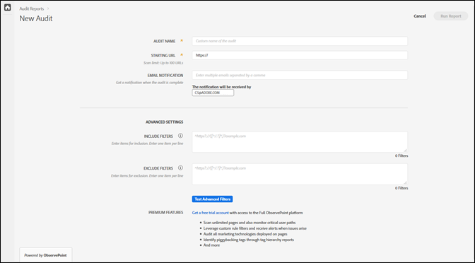
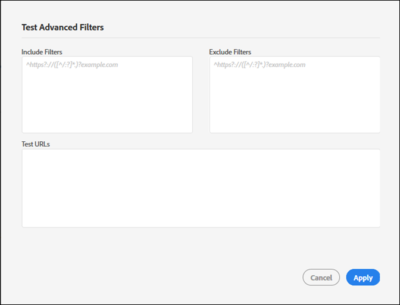

# 新建审核{#create-a-new-audit}

>[!NOTE]
>
>对于用户，限制每次只能运行一项审核。如果您尝试运行的审核与正在运行的审核设置相同，则会发生错误。如果要取消当前正在运行的审核以便新建一个审核，则可以使用错误消息中的链接。

如果需要，请使用页面底部的链接，以访问功能齐全且免费的 ObservePoint 试用帐户。

1. 从 Auditor 列表中，单击 **[!UICONTROL New Audit]**（新建审核）。

   将会打开 [!DNL New Audit] 屏幕。

   

1. （必须）命名审核。

   名称最多可包含 250 个字符。
1. （必须）指定起始 URL。

   指定起始 URL 时，必须填写协议。起始 URL 是审核开始爬网的页面。启动后，Auditor 将可以对多达 500 个页面进行爬网，并关注以起始 URL 开头的链接。有关更多信息，请参阅[包含和排除过滤器](../create-audit/filters.md)。起始 URL 最多可包含 250 个字符。

   >[!NOTE]
   >
   >在某些情况下，完成 500 个页面的扫描可能需要长达 48 小时。

1. 指定一个或多个电子邮件地址，用于接收关于审核的通知。

   您可以指定多个电子邮件地址，每个邮件地址之间用逗号分隔。默认情况下，会通知请求者。将实时验证电子邮件地址。如果输入的地址无效，屏幕上则会显示相关通知。

   每个电子邮件地址的长度不超过 250 个字符，包括域名后辍在内（例如 .com）。
1. 指定“Include Filter”（包含过滤器）。

   此字段可包含精确的 URL、部分 URL或正则表达式。使用此字段可指定您希望每个 URL 满足的条件。任何与“Include Filter”（包含过滤器）条件不匹配的爬网 URL，将不会纳入审核结果中。

   您可以输入希望审核扫描的目录。或者，您可以执行跨域或自我分派审核，其中，您需要在一个域开始审核，并在另一个域结束审核。为此，请键入要遍历的域；对于复杂的 URL 模式，请使用正则表达式。

   >[!NOTE]
   >
   >如果某个页面包含在过滤器中，但该页面未连接到起始 URL，或者 Auditor 在扫描了 500 个页面之后才发现该页面，那么将不会扫描该页面，也不会将其纳入测试结果中。

   “Include Filter”（包含过滤器）限制每行最多为 1,000 个字符。

   有关更多信息，请参阅[包含列表](../create-audit/filters.md)。
1. 指定“Exclude Filter”（排除过滤器）。

   排除列表可阻止审核 URL。使用精确的 URL、部分 URL 或正则表达式，就像在“Include List”（包含列表）中一样。

   一种常见做法是，如果审核涉及用户会话，则排除注销链接（例如：`/logout` 表示包含字符串 `/logout` 的任意 URL)。

   “Exclude Filter”（排除过滤器）限制每行最多为 1,000 个字符。

   有关更多信息，请参阅[排除列表](../create-audit/filters.md)。
1. （可选）如果需要，您可以测试包含和排除过滤器，并测试 URL。

   输入过滤器和 URL，然后单击 **[!UICONTROL Apply]**（应用）以运行测试。

   

1. 单击 **[!UICONTROL Run Report]**（运行报告）。
