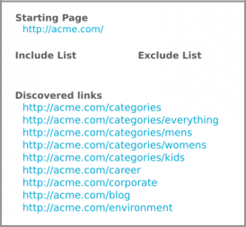

# 包含和排除过滤器{#include-and-exclude-filters}

“Include Filter”（包含过滤器）会限制审核可以从起始 URL 爬网的链接。“Exclude Filter”（排除过滤器）会阻止审核爬网链接。

<!--
Content from ObservePoint (https://help.observepoint.com/articles/2872121-include-and-exclude-filters) with their permission. Modified slightly for style and Auditor emphasis.
-->

“Include Filter”（包含过滤器）和“Exclude Filter”（排除过滤器）提供了审核准则。通过将“Include Filter”（包含过滤器）和“Exclude Filter”（排除过滤器）留空，审核可以爬网遇到的任何链接，从起始 URL 上的链接开始。


通过应用“Include Filter”（包含过滤器）、“Exclude Filter”（排除过滤器）或二者的组合，可以为审核提供有关能够爬网哪些链接的操作说明。

Any item in the [!UICONTROL Include Filters] field restricts the scan to only the pages that match that item. Any item in an [!UICONTROL Exclude Filters] field prevents any pages that match that item from being scanned.

“Include Filter”（包含过滤器）和“Exclude Filter”（排除过滤器）可以是与有效页面匹配的完整 URL、部分 URL 或正则表达式。

## 优先顺序 {#section-e9d42419dd3f459bb20e7a33c6104f12}

1. **起始 URL** 优先于所有其他 URL，并且在审核过程中始终可以获得访问，即使某个起始 URL 与“Exclude Filter”（排除过滤器）中的项目匹配也是如此。在获得访问方面，起始 URL 始终先于所有其他 URL。

   

   在上图中，审核会从起始页面的 `document.links` 属性中查找链接。这些链接符合供审核扫描的资格。

1. **Include URL**（包含 URL）必须从起始页链接，否则将无法发现这些 URL，也无法对其进行访问。

   

   在上图中，添加“Include Filter”（包含过滤器）可将符合条件的 URL 限制为与相应过滤器匹配的 URL。现在，只有五个链接符合供审核扫描的资格。

1. **Exclude URL**（排除 URL）可排除符合条件的链接。

   

   在上图中，添加“Exclude Filter”（排除过滤器）可阻止符合条件的链接中的 URL。现在，只有三个链接符合供审核扫描的资格。

## 起始 URL {#section-ccb46abcd96f4a8ab171245015d2b724}

Adobe Experience Platform审计师需要为起始URL提供一个页面。 在获得访问方面，起始 URL 始终先于所有其他 URL。任何从起始页面中发现的链接都有资格获得访问，但是必须以遵循“Include Filter”（包含过滤器）和“Exclude Filter”（排除过滤器）为条件。如果“Exclude”（排除）项目与起始 URL 匹配，则忽略该项。

## “Include Filter”（包含过滤器） {#section-7626060a56a24b658f8c05f031ac3f5f}

“Include Filter”（包含过滤器）可以限制审核期间可供扫描的链接。“Include Filter”（包含过滤器）可以是：

* 完全限定的 URL
* 部分 URL
* 匹配完整或部分 URL 的正则表达式
* 以上各项的任意组合

将 URL 或正则表达式添加到“Include Filter”（包含过滤器），并不能保证审核期间会扫描这些特定的 URL。审核会检查起始 URL 上的链接，然后浏览符合条件的链接。审核会继续执行检查和浏览的过程，直至达到 500 个扫描的 URL 上限为止，或直至找不到符合条件的链接。

>[!NOTE]
>
>在某些情况下，完成 500 个页面的扫描可能需要长达 48 小时。

默认情况下，审核会扫描起始 URL 的所有子域。除非通过提供“Include Filter”（包含过滤器）来显式覆盖，否则扫描将采用以下含有正则表达式的“Include Filter”（包含过滤器）：

`^https?://([^/:\?]*\.)?mysite.com`

该过滤器允许在起始 URL 页面上找到的任何链接，都可以得到访问。它与起始 URL 中任意子域上的任何页面相匹配。

使用默认的“Include Filter”（包含过滤器），可以向审核提供广泛的爬网范围。要在某些部分或页面中进入主页，请在此框中添加过滤器，以便为审核提供特定指示。在这种情况下，将默认值替换为您希望审核扫描的目录。您还可以使用“包括过滤器”执行跨域审计，您需要在一个域上开始审计并在另一个域上结束审计。 为此，请键入要遍历的域。无论如何，要找到任何“包括”过滤器URL，必须在已审核的页面上发现它们。

“包括”过滤器可以包含精确的URL、部分URL或常规表达式。 例如，如果“起始 URL”是 [!DNL http://mysite.com]，则默认情况下可以扫描以下页面（请注意粗体字符）：

```html
http://mysite.com
http
<b>s</b>://mysite.com
http://
<b>www</b>.mysite.com/home
http://
<b>dev</b>.mysite.com/home
http://
<b>my</b>.mysite.com/products/products_and_services.html
```

对于复杂的 URL 模式，请使用 [ObservePoint 的正则表达式测试程序](https://regex.observepoint.com/)。

## “Exclude Filter”（排除过滤器）{#section-00aa5e10c878473b91ba0844bebe7ca9}

“Exclude Filter”（排除过滤器）会阻止审核 URL。您可以使用精确的 URL、部分 URL 或正则表达式。与“Exclude Filter”（排除过滤器）中的项目匹配的任何 URL，均不会得到访问。如果“Exclude Filter”（排除过滤器）中包含起始 URL，则不排除该 URL。审核始终会扫描起始 URL。

## 测试过滤器和 URL {#section-3cfa125b1756411395a64701e128efa0}

您可以在Platform Auditor中测试过滤器和URL。

在创建审核时，单击 **[!UICONTROL Test Advanced Filters]**（测试高级过滤器）。输入过滤器和 URL，然后单击 **[!UICONTROL Apply]**（应用）。


## ObservePoint 文档 {#section-79cdc8e850d047969b6d2badf6bbd6f9}

本文是与 ObservePoint 共同编写的。有关最新信息，请参阅 [ObservePoint 文档](https://help.observepoint.com/)。
