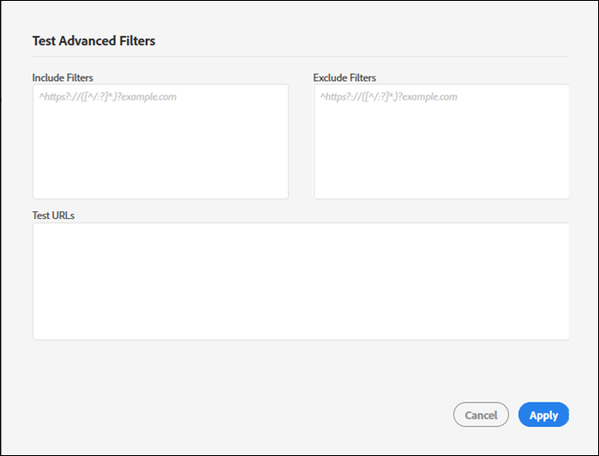

# 包括和排除过滤器{#include-and-exclude-filters}

包含过滤器可限制审核可从“开始URL”爬入的链接。 排除过滤器可防止审核搜索链接。

<!--
Content from ObservePoint (https://help.observepoint.com/articles/2872121-include-and-exclude-filters) with their permission. Modified slightly for style and Auditor emphasis.
-->

包括过滤器和“排除”过滤器提供了审计准则。 通过将“包括”和“排除”过滤器留空，审计可以从“开始URL”上的链接开始搜索它遇到的任何链接。


通过应用“包括”过滤器、“排除”过滤器或两者的组合，可以给出有关审计可以爬行哪些链接的说明。

“包括过滤器”字段中的任何项目都将扫描限制为仅与该项目匹配的页面。 “排除过滤器”字段中的任何项目都会阻止扫描与该项目匹配的任何页面。

“包括”和“排除”过滤器可以是与有效页面匹配的完整URL、部分URL或正则表达式。

## 优先顺序 {#section-e9d42419dd3f459bb20e7a33c6104f12}

1. **开始URL** 优先于所有其他URL，并且始终在审核过程中会被访问，即使URL与“排除”过滤器中的项匹配也是如此。 始终会在访问任何其他URL之前访问起始URL。

   

   在上图中，审核会从起始页的属性中查找链 `document.links` 接。 这些链接有资格由审核扫描。

1. **包含URL** 必须从起始页链接，否则将无法发现它们，也不会对其进行访问。

   

   在上图中，添加“包含”过滤器会将符合条件的URL限制为与过滤器匹配的URL。 现在，审核只有五个链接有资格扫描。

1. **排除URL** ，将从资格中删除链接。

   

   在上图中，添加“排除”过滤器可阻止符合条件的链接的URL。 现在，审核只能扫描三个链接。

## 起始URL {#section-ccb46abcd96f4a8ab171245015d2b724}

Auditor需要为起始URL提供一个页面。 始终会在访问任何其他URL之前访问起始URL。 从起始页面中搜索到的任何链接都有资格被访问，但必须遵循“包括”和“排除”筛选器。 如果“排除”项与“起始URL”匹配，则忽略该项。

## 包括滤镜 {#section-7626060a56a24b658f8c05f031ac3f5f}

“包括”过滤器限制在审核过程中有资格扫描哪些链接。 包括过滤器可以是：

* 完全限定的URL
* 部分URL
* 匹配完整或部分URL的正则表达式
* 以上各项的任意组合

将URL或正则表达式添加到“包括”过滤器不保证在审核中扫描这些特定URL。 审核检查“开始URL”上的链接，然后导航到符合条件的链接。 审核会继续检查和导航此过程，直到达到500个扫描URL的限制，或直到找不到符合条件的链接。

>[!NOTE]
>
>在某些情况下，完成500页的扫描可能需要48小时。

默认情况下，审核将扫描起始URL的所有子域。 除非通过提供包含过滤器显式覆盖，否则扫描将使用以下正则表达式包含过滤器：

`^https?://([^/:\?]*\.)?mysite.com`

这使得在“开始URL”页面上找到的任何链接都有资格访问。 它与起始URL中任何子域上的任何页面匹配。

使用默认的“包括”过滤器可提供范围广泛的审核来搜索。 要在某些部分或页面中进入主页，请在此框中添加过滤器，为审核提供特定指导。 在这种情况下，将默认值替换为您希望审核扫描的目录。 您还可以使用包含过滤器来执行跨域审计，您需要在一个域上开始审计，在另一个域上结束审计。 为此，请键入要遍历的域。 无论如何，要找到任何“包含过滤器URL”，都必须在已审核的页面上发现它们。

“包括过滤器”可包含精确的URL、部分URL或正则表达式。 例如，如果“开始URL” [!DNL http://mysite.com]为，则以下页面将有资格在默认情况下进行扫描（请注意粗体字符）:

```
http://mysite.com
http
<b>s</b>://mysite.com
http://
<b>www</b>.mysite.com/home
http://
<b>dev</b>.mysite.com/home
http://
<b>my</b>.mysite.com/products/products_and_services.html
```

对于复杂的URL模式，请使 [用ObservePoint的正则表达式测试程序](http://regex.observepoint.com/)。

有关常见模式匹 [配用例，还请参阅ObservePoint的“常用正则表达式](https://help.observepoint.com/articles/2872116-common-regular-expressions-for-observepoint) ”文档。

## 排除过滤器 {#section-00aa5e10c878473b91ba0844bebe7ca9}

“排除”过滤器会阻止审核URL。 您可以使用精确的URL、部分URL或正则表达式。 不会访问与“排除”过滤器中的项匹配的任何URL。 如果“排除”过滤器中包含您的“起始URL”，则不排除它。 始终由审核扫描起始URL。

## 测试过滤器和URL {#section-3cfa125b1756411395a64701e128efa0}

您可以在Auditor中测试您的过滤器和URL。

在创建审核时，单击“测 **[!UICONTROL 试高级过滤器”]**。 输入您的过滤器和URL，然后单击“ **[!UICONTROL 应用]**”。



## ObservePoint文档 {#section-79cdc8e850d047969b6d2badf6bbd6f9}

本文是与ObservePoint共同开发的。 有关最新信息，请参阅 [ObservePoint文档](https://help.observepoint.com/articles/2872121-include-and-exclude-filters)。
