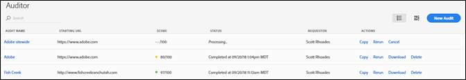
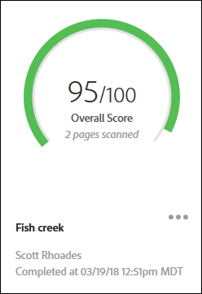
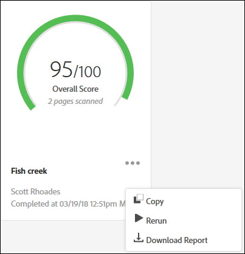

# “Audit List”（审核列表）页面{#audit-list-page}

“Audit List”（审核列表）页面可显示所有审核的信息。

启动 Auditor 后，会显示“Audit List”（审核列表）页面。您可以在列表视图或卡片视图中查看“Audit List”（审核列表）页面。

## 列表视图 {#section-a428749d2ab94a08bf460e6a486b844a}

列表视图可显示每项审核的以下信息。

* 审核名称
* 起始 URL

   审核开始爬网页面的 URL。
* 得分

   审核得分从 1 到 100 分不等，其中 100 分表示扫描的页面上没有任何问题。
* 状态

   显示审核的完成时间，或审核正在处理。
* 请求者

   显示创建审核的用户名称。
* 操作

   提供用于复制或重新运行审核、取消当前正在运行的审核、将报表下载为 Excel 电子表格，或删除审核的链接。

单击审核名称可查看审核结果。

## 卡片视图 {#section-6826b585e53a46daa722b9bd3eda926e}

卡片视图将以图形格式显示每项审核。

单击审核名称可查看审核结果。单击该名称旁边的菜单，可查看用于复制、重新运行或取消审核的链接，或将完成的报表下载为 Excel 电子表格或 PDF：

