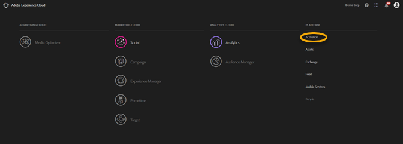
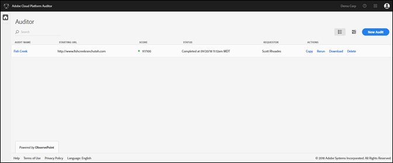
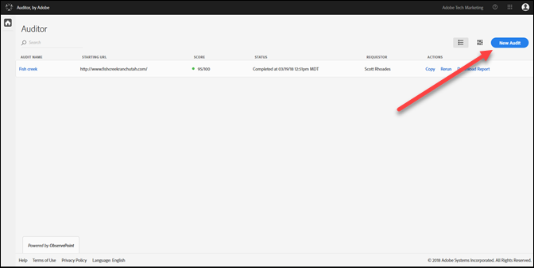
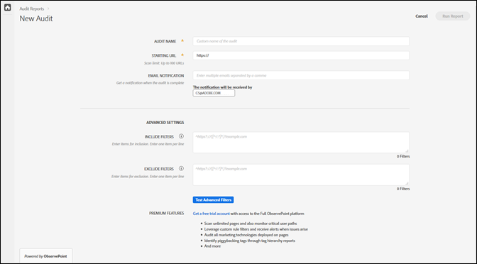
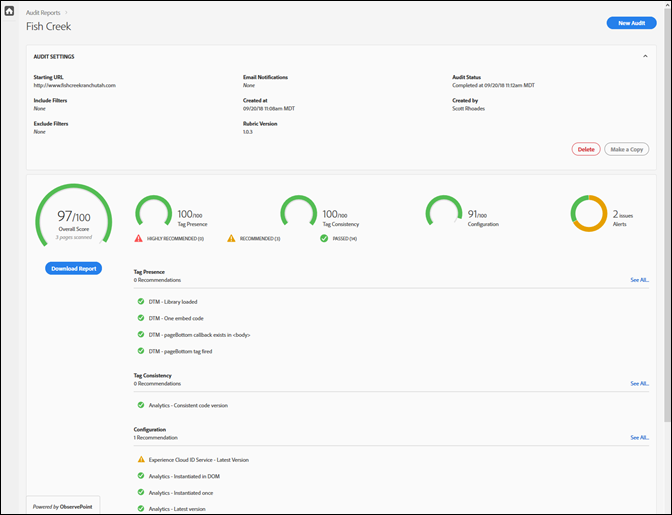

# 入门指南{#getting-started}

## 入门指南 {#task-1024e94b5948413295c9698e62165a04}

<!--
This page is a placeholder for now, we need things like prerequisites, any planning that should be done before using Auditor, initial setup info--that kind of thing.
-->

第一次使用 Auditor 时，您必须填写并接受 Auditor 协议。Auditor 是 Adobe 与 ObservePoint 合作开发的成果。Auditor 用户可以使用有限的 ObservePoint功能，而无需支付额外费用。要使用 Auditor，您必须选择加入 ObservePoint 通信。

## 运行首次扫描 {#task-b211597afed343cfa238443fcf7c6041}

1. 单击 Adobe Experience Cloud 导航栏右上角的菜单按钮，然后单击 **[!UICONTROL Activation]**（激活）。

   

1. 选择“Auditor”并接受相关的使用条款。

   Auditor 页面会为您提供以前扫描的功能板，以及运行新扫描的选项。

   

1. 单击 **[!UICONTROL New Audit]**（新建审核）。

   要运行新的扫描，请单击屏幕右上角的 **[!UICONTROL New Audit]**（新建审核）。

   

1. 配置扫描。

   命名审核，提供起始 URL，然后单击 **[!UICONTROL Run Report]**（运行报表）。扫描完成后，您将收到电子邮件通知。

   

   有关所有配置选项的说明，请参阅[新建审核](../create-audit/create-new-audit.md)。
1. 查看报表。

   当您收到通知您扫描已完成的电子邮件时，请单击相应的链接以[查看报表](../reports/scorecard.md)，并开始了解改进实施以及从 Adobe 解决方案中获得更多价值的机会。

   您还可以单击 [Auditor 页面](../get-started/audit-list.md)中的审核名称，以查看审核状态，并在审核完成后查看报表。

   
