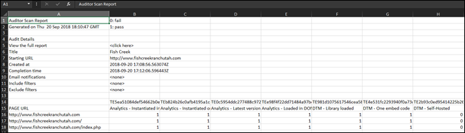

# 下载报表{#download-report}

报表可显示每个 URL 是通过还是失败。

可在用户界面的“Scorecard”（评分卡）页面上查看报表。您还可以通过以下方法下载报表：

1. 在 Auditor 列表或评分卡中，单击 **[!UICONTROL Download Report]**（下载报表）。

   可以将报表下载为电子表格或 PDF 文件。
1. 指定是打开或是保存文件。

1. 单击&#x200B;**[!UICONTROL 确定]**。

   电子表格可显示是否通过了您的每个页面上的每项测试。

   

PDF 文件可显示以下信息：

* 与审核有关的设置
* 完成时间戳
* 整体得分
* 每项类别的得分
* 应用在 URL 中失败的单元测试
* 根据测试提供的建议和帮助文档链接
