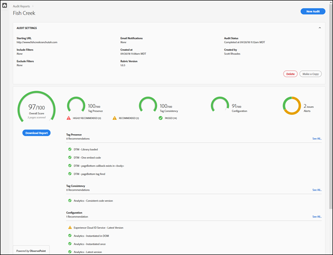
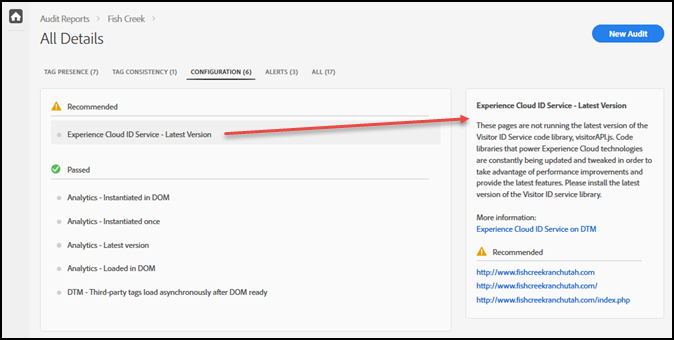

# 评分卡{#scorecard}

运行测试后，评分卡会显示有关审核的信息。

单击 Auditor 页面上的审核名称，可查看测试结果。

使用评分卡，可查看审核针对以下类别的评分情况：

* 整体得分
* 标记存在

   评估标记是否存在，以及标记是否位于页面代码中的正确位置。
* 标记一致性

   评估各个 URL 中的标记是否一致。
* 配置

   根据其他规则和建议的最佳做法来评估标记。
* 警报

   警报会显示您应该注意的问题，但是不会影响您的得分。

您的得分取决于每个测试的权重以及您是否通过测试。如果通过测试，则得分会按照与测试权重等价的分值增加。

* 0：通过警报，提醒您应该注意的问题，但是不影响您的得分。
* 1：建议进行优化。不影响数据准确性。
* 2：如果未通过这个测试，则意味着您将不能访问 Adobe Experience Cloud 中的最新功能和修复。
* 3：测试效能并判断实施期间是否遵循了强烈建议的最佳做法。
* 4：失败，这意味着您可能正在收集不可靠的数据。
* 5：失败，这意味着您可能会遭遇数据丢失。

评分卡会列出&#x200B;**强烈建议**&#x200B;您修复的所有 4 级或 5 级问题。

评分卡会列出&#x200B;**建议**&#x200B;您修复的所有 1 级到 3 级问题。

单击 **[!UICONTROL Download the Report]**（下载报表），可下载包含审核期间报告的信息在内的文件（Excel 或 PDF 格式）。

除了每个类别的得分之外，评分卡还会列出建议或强烈建议的所有修复，以及通过测试的项目。单击每个问题，可在右侧框中查看更多详细信息。再次单击可进一步展开，并查看有关解决问题的建议。下面显示了上述评分卡中与“建议”修复的问题有关的详细信息：

单击屏幕顶部的类别，可查看在每个类别中找到的问题。

## 哪些页面是测试的一部分？{#section-fd38ffeb868648e89c34c5772fa65f46}

您可以查看通过或未通过测试的 URL 列表。

在“Scorecard”（评分卡）中，单击测试名称或每个类别标题下方的 **[!UICONTROL See All]**（查看全部）链接。这将允许您查看测试的详细信息。对于每个测试，您可以看到测试说明以及失败和通过测试的所有 URL 列表。此信息也包含在下载的报表中。
